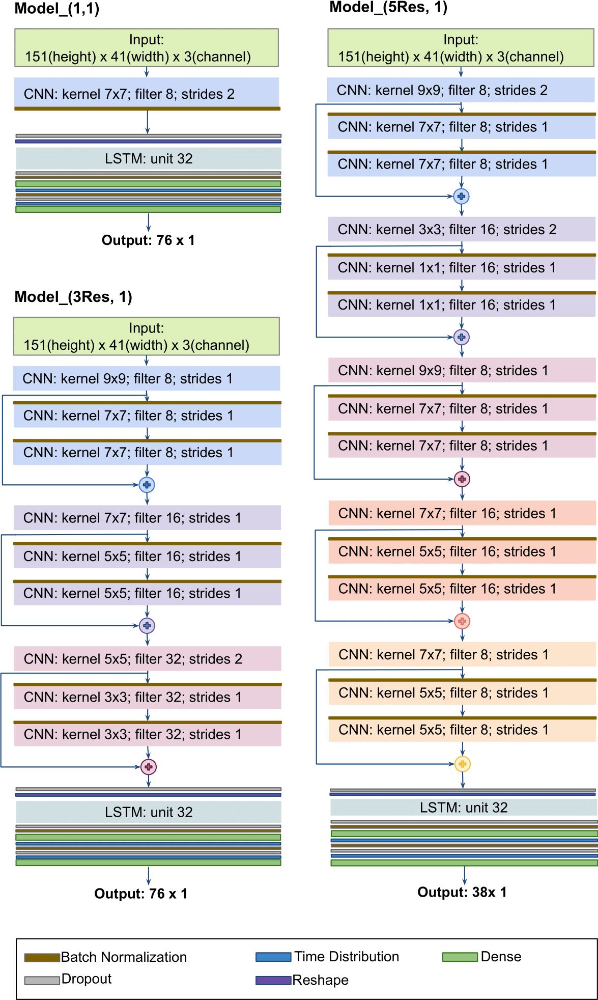

# LightEQ: On-Device Earthquake Detection with Embedded Machine Learning
This paper presents a data processing pipeline and lightweight deep-learning models for detecting seismic events that can be deployed on small devices such as microcontrollers. We have conducted an extensive hyperparameter search and developed three models that were evaluated using the Stanford Earthquake Dataset(STEAD). The smallest model was found to be highly efficient, consuming only 193 kB of RAM and having an F1 score of 0.99 with just 29k parameters. 

 
Download the STEAD dataset from here: https://github.com/smousavi05/STEAD
Location to my dataset is in folder /home/tza/STEAD -> to reproduce the code, you need to change the path to your downloaded dataset


This code is divided into 5 sections
--mode=split -> it will just divide the dataset

``` python lighteq_original.py --mode=split```

--mode=prepare -> which will preprocess dataset

``` python lighteq_original.py --mode=prepare```

--mode=train -> for training models 

``` python lighteq_original.py --mode=train```

--mode=test -> once a model is trained you can simply test it using this mode configuration and setting --quant=0

``` python lighteq_original.py --mode=test --quant=0```

--mode=quant -> you can also post-quantize the trained model and set --tflite_mode= options[0,1,2,3] to select different options for post-quantization and test it using --mode=test and --quant=1.

``` python lighteq_original.py --mode=quant --tflite_mode=2```

``` python lighteq_original.py --mode=test --quant=1```

